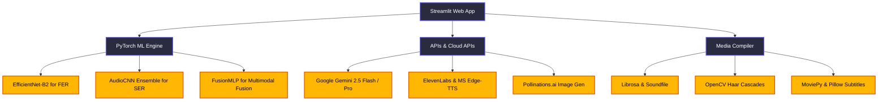

# 🌙 Dreamweaver — End-to-End Project Scan & Analysis Report

Dreamweaver is an interactive, multimodal AI application designed to detect a child's emotional state (Happy, Neutral, or Sad) using facial expressions and voice recordings, dynamically generating a personalized, narrated, and illustrated bedtime story video.

---

## 📂 Repository Structure & Modules

The project is structured modularly to decouple model definition, inference pipelines, generation services, and UI rendering:

```text
D:\Emotion Recognition\
 ├── app.py                          # Streamlit application orchestrator (main entry point)
 ├── config.py                       # Global configuration variables, hyper-parameters, and settings
 ├── requirements.txt                # Project library dependencies
 ├── README.md                       # High-level developer documentation
 │
 ├── models/                         # Neural network architecture definitions & caching loaders
 │    ├── __init__.py
 │    ├── architectures.py           # SEBlock, ResidualBlock, AudioCNN, and FusionMLP
 │    └── loader.py                  # PyTorch weight loading using @st.cache_resource
 │
 ├── inference/                      # Modality inference logic
 │    ├── __init__.py
 │    ├── face.py                    # Facial crop quality check & 4-fold TTA inference
 │    ├── audio.py                   # Mel-spectrogram feature extraction & AudioCNN ensemble inference
 │    └── fusion.py                  # Late-fusion MLP, Context-Awareness, and Temporal Stabilizer
 │
 ├── generation/                     # Content synthesis connectors (APIs & wrappers)
 │    ├── __init__.py
 │    ├── story.py                   # Gemini LLM bedtime story generator & structured fallbacks
 │    ├── tts.py                     # ElevenLabs and async Microsoft Edge-TTS voice generation
 │    └── images.py                  # Pollinations.ai image generator with custom User-Agent retry client
 │
 ├── video/                          # Slideshow compiler
 │    ├── __init__.py
 │    └── assembler.py               # MoviePy video assembler with manual Pillow subtitle rendering
 │
 ├── ui/                             # Modular UI layout elements
 │    ├── __init__.py
 │    ├── styles.py                  # CSS injector (custom HSL theme, cards, custom buttons)
 │    ├── sidebar.py                 # Key management sidebar panel
 │    ├── input_panel.py             # User inputs panel (webcam capture, mic record, file upload)
 │    └── output_panel.py            # Results panel (badge, probability breakdowns, video player)
 │
 └── notebooks/                      # Development & evaluation notebooks
      ├── 01_FER_Training_Testing.ipynb
      ├── 02_SER_Training_Testing.ipynb
      ├── 03_Multimodal_Testing_and_Evaluation.ipynb
      └── 04_Personalized_Bedtime_Story_Generation.ipynb
```

---

## 🛠️ Technology Stack



*   **Deep Learning & Inference**: PyTorch, torchvision.
*   **Computer Vision**: OpenCV (Haar Cascades for face detection), PIL/Pillow (image compositing, subtitle overlays).
*   **Audio DSP**: Librosa, Soundfile (silence trimming, normalization, mel-spectrogram extraction).
*   **Generative AI**: `google-generativeai` (Gemini API for text/JSON prompts), `edge-tts` (async Microsoft Neural Voices), ElevenLabs API, Pollinations.ai (stable diffusion images).
*   **Web Interface**: Streamlit (web framework), `streamlit-audiorec` (custom HTML5/JS audio recording widget).
*   **Video Assembly**: MoviePy (multitrack video composition).
*   **Concurrency**: `nest-asyncio` (to run asynchronous Edge-TTS synthesizers within Streamlit's running event loop).

---

## 📈 Model Performance & Results Achieved

The training logs cached in the notebooks show strong unimodal baselines that are significantly boosted by late decision fusion:

### 1. Facial Emotion Recognition (FER)
*   **Dataset**: FER2013 (pruned from 7 classes to 3: Happy, Neutral, Sad).
*   **Backbone**: `EfficientNet-B2` (pretrained on ImageNet, adapted linear classifier).
*   **Training Schedule**:
    *   *Stage 1*: Partial fine-tuning (classifier head and deep blocks) for 12 epochs.
    *   *Stage 2*: Conservative fine-tuning (low learning rate) for 5 epochs.
*   **Accuracies**:
    *   Stage 1 Val Accuracy: **79.57%**
    *   Stage 2 Val Accuracy: **79.85%** (F1 Weighted: **80.00%**)
    *   Manual Out-of-Distribution Test Set (90 real images): **83.33%** accuracy (Happy F1: 0.90, Sad F1: 0.82, Neutral F1: 0.78).

### 2. Speech Emotion Recognition (SER)
*   **Dataset**: RAVDESS & TESS.
*   **Backbone**: Custom `AudioCNN` with Squeeze-and-Excitation attention blocks (`SEBlock`) and Conv `ResidualBlocks`.
*   **Training Schedule**: Multi-seed ensemble training (seeds: 42, 123, 999).
*   **Accuracies**:
    *   Seed 42 Accuracy: **78.47%**
    *   Seed 123 Accuracy: **69.79%**
    *   Seed 999 Accuracy: **74.31%**
    *   **Ensemble Accuracy (Averaging Probabilities)**: **79.86%** (Gain of **+1.39%** over the best single model). Per-class metrics: Happy is hard (57.1%), Neutral (89.5%), Sad (87.7%).

### 3. Multimodal Late Fusion
*   **Architecture**: `FusionMLP` (concatenated probabilities, prior history, and model reliability inputs).
*   **Accuracies**:
    *   MLP Validation Accuracy (Synthetic sample evaluation): **95.11%** (Early stopped at epoch 192).
    *   **Final System Test Set (240 evaluation frames)**: **95.00%** accuracy and **95.00%** weighted F1 score.
    *   Uncertain frames flagged: 31/240.
    *   Conflict frames flagged: 15/240.

---

## 🎯 Features Offered

1.  **Dual-Modality Recording**:
    *   *Face Capture*: Live webcam widget or manual file uploader (JPG, PNG).
    *   *Audio Recording*: Live in-browser voice recording (HTML5/JS widget) or WAV file upload.
2.  **Context-Aware Fusion**:
    *   Recognizes that kids' emotional states have temporal persistence. Prior runs bias future steps.
    *   Displays real-time conflict/uncertainty warnings when inputs disagree or are low quality.
3.  **Adaptive Story Generation**:
    *   Configures Google Gemini prompts based on mood:
        *   **Sad**: Comforting, warm themes centering on supportive friends/family.
        *   **Happy**: Adventurous, creative fantasy stories.
        *   **Neutral**: Calming, sensory nature narratives to lower heart rate.
    *   Uses structured API calls with `response_mime_type: "application/json"` to simultaneously extract story paragraphs and image scene illustration prompts.
4.  **Premium/Free TTS Engines**:
    *   *ElevenLabs*: High-fidelity neural voice story narration.
    *   *Microsoft Edge-TTS*: Local asynchronous fallback that changes speed and pitch dynamically matching the emotion (e.g., Sad slows narration by 18%, lowers pitch by 4Hz; Happy speeds up by 12%, raises pitch by 4Hz).
5.  **Robust Subtitle Rendering**:
    *   Renders wrapped text blocks on semi-transparent background strips directly on image copy matrices using PIL. Avoids Windows ImageMagick path configuration bugs completely.
6.  **Slide Compilation**:
    *   Automatically divides audio duration equally by slides and compiles an MP4 video, serving a direct download button.

---

## 🧠 Feature Engineering Details

The high accuracy and robustness of the project are due to sophisticated, hand-crafted features:

### 1. Computer Vision Features (FER)
*   **Image Quality Score ($Q_f$)**: Heuristic combining Laplacian variance (focus/sharpness) and average brightness proximity to mid-gray.
    $$blur\_norm = \min(Var(Laplacian(gray)) / 1000, 1.0)$$
    $$bright\_norm = 1.0 - \frac{|Mean(gray) - 127|}{127}$$
    $$Q_f = 0.7 \times blur\_norm + 0.3 \times bright\_norm$$
*   **Softmax Temperature Scaling**: Scales raw probabilities to mitigate overconfidence before late fusion:
    $$p'_i = \frac{e^{z_i / T}}{\sum_j e^{z_j / T}} \quad (T_{face} = 1.2)$$
*   **Reliability Index ($R_f$)**: Custom metric reflecting the model's prediction credibility:
    $$R_f = 0.7 \times \max(p') + 0.3 \times Q_f$$

### 2. Digital Signal Processing Features (SER)
*   **Audio Quality Score ($Q_a$)**: Estimated from the Root Mean Square (RMS) energy of the sound wave. Low energy = silence or empty capture.
    $$Q_a = \min(\text{RMS}(y) / 0.1, 1.0)$$
*   **Multi-Channel Auditory Spectrogram**:
    Instead of single-channel mel-spectrograms, the pipeline generates a **3-channel representation** of shape `(3, 128, 130)` (analogous to RGB channels):
    1.  *Channel 1*: Mel-spectrogram in decibels (power-to-DB).
    2.  *Channel 2*: Mel-spectrogram Delta (first derivative capturing rate of frequency changes).
    3.  *Channel 3*: Mel-spectrogram Delta-Delta (second derivative capturing acceleration of frequency changes).
*   **Z-Score Standardization**: Normalizes features across each channel independently to ensure model convergence:
    $$X_{norm} = \frac{X - \mu}{\sigma + \epsilon}$$
*   **Reliability Index ($R_a$)**: Matches the vision channel:
    $$R_a = 0.6 \times \max(p') + 0.4 \times Q_a$$

### 3. Multimodal Decision Fusion Features
*   **MLP Feature Assembly**: Fuses predictions into an 11-dimensional input feature:
    $$x_{fusion} = [p_{face\_happy}, p_{face\_neutral}, p_{face\_sad}, p_{audio\_happy}, p_{audio\_neutral}, p_{audio\_sad}, p_{ctx\_happy}, p_{ctx\_neutral}, p_{ctx\_sad}, R'_f, R'_a]$$
*   **Linear Ramped Context Prior ($p_{ctx}$)**: Derived from recent session history (window size 5). More recent steps are linearly scaled up to establish context:
    $$weight(t) = \frac{t + 1}{N_{history}}$$
*   **EMA Probability Smoothing**:
    Smooths current frames with past probability distributions to avoid rapid emotion jumps (e.g. flickering during a blink):
    $$p_{smoothed}(t) = \alpha \times p_{fused}(t) + (1 - \alpha) \times p_{smoothed}(t-1) \quad (\alpha = 0.35)$$
*   **Inertia / Transition Penalty**:
    If the predicted state changes ($E_t \neq E_{t-1}$), the transition penalty ($0.12$) is subtracted from the new dominant emotion probability and added to the old state probability. This prevents jitter around decision boundaries.
*   **Predictive Uncertainty Assessment**:
    Determines if the inputs represent anomalous or bad-quality data using Shannon entropy:
    $$H(p) = -\sum_{i} p_i \log_2(p_i)$$
    If $H(p) > 1.10$, the system alerts the UI that predictions are low-confidence.

---

> [!TIP]
> The system's late fusion setup is incredibly robust because it can handle partial dropouts. If the webcam is skipped or mic permission is denied, the system bypasses MLP fusion and performs unimodal inference automatically. If both fail, it falls back to a neutral bedtime story, ensuring the child's bedtime routine is never disrupted.
